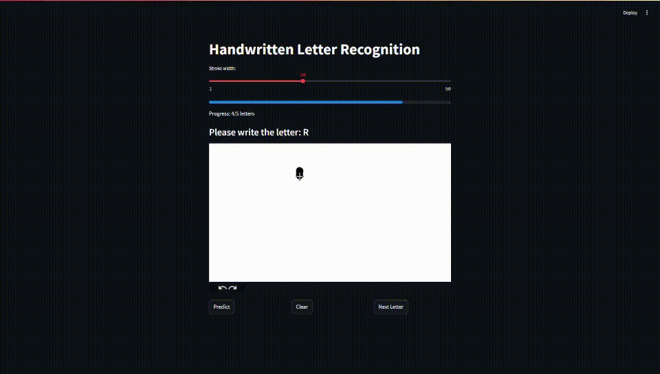

# Interactive Educational Program for Children
- Try to learn and get good results for HWR.
- Our project aims to make learning fun by creating an interactive program where children can draw letters on a screen and get immediate feedback. 

# Model
- Using the `EMNIST` letter split, we got a good `Test Accuracy: 94.56%`.
- We used a CNN model
- You can see the training code in the [Notebook](CODE)
- Then saved the model as `ONNX` for speeding up the GUI and make the application lightweight.

# Letter Recognition
- Finds letter shapes in an image,Returns boxes around each letter.
- Adds padding around the image to make it square., Rotates and flips the image to prepare it for model input.

# GUI
- We made a GUI with streamlit that has a canvas to draw the letter then the CNN model predict the letter and Feedback is given to the user(correct/incorrect).
- The user starts the test, which consists of 5 letters that they are supposed to write correctly. If he get one wrong, he has 3 attempts to write the letter correctly. After  that, he will receive a score out of 5 based on these letters.

# Installing
- First clone the repo ``
- Then change the directory ``
- Then install the requirements `pip install -r requirements.txt`
